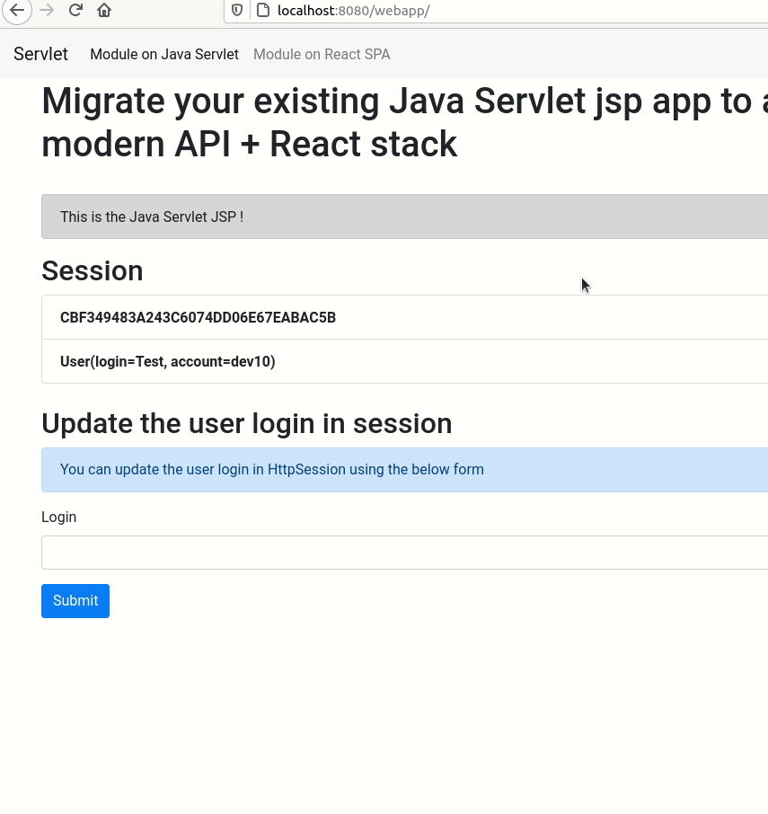

# Java Web Servlet project with a Jersey API 

This Java project is a Java Servlet JSP app including also a running Jersey API on `/api/*`. 

The goal of this demo is to demonstrate how to build such an app and how to use it with a React SPA running alongside the Java Servlet App. 

All of that in order to allow you to progressively migrate your historic Java Servlet App to a more modern stack.  



## Build the Java Servlet App

You can find a more detailed information following this repository: [Jersey Injection Dependency example with HK2](https://github.com/m4nu56/jersey-hk2) 

## The Servlet App

We create an unique Servlet to cover our example: `SrvHome`
It will be mapped to the root path `/` in `web.xml`:

```xml
<servlet>
    <servlet-name>SrvHome</servlet-name>
    <servlet-class>com.SrvHome</servlet-class>
    <load-on-startup>1</load-on-startup>
</servlet>
<servlet-mapping>
    <servlet-name>SrvHome</servlet-name>
    <url-pattern></url-pattern>
</servlet-mapping>
```

In our Servlet we are setting a `User` in session and we handle a form submit that will update the user login: 

```java
public class SrvHome extends HttpServlet {

	@Override
	protected void doGet(HttpServletRequest request, HttpServletResponse response) throws ServletException, IOException {
		User user = (User) request.getSession().getAttribute("user");

		// initialize user if not exists in session
		if (user == null) {
			user = new User("m4nu56", "dev10");
		}

		// handle form submit to update user login
		if (request.getParameter("input-login") != null) {
			user.setLogin(request.getParameter("input-login"));
		}

		// set user in session
		request.getSession().setAttribute("user", user);

		// forward to the jsp
		request.getRequestDispatcher("index.jsp").forward(request, response);
	}

}
```

In the `index.jsp` we simply display:
- HttpSession information
- Form to update the User login
- Menu to navigate to the React SPA

## Cookie

We want the generated `JSESSIONID` Cookie to be available for all apps on the domain where the Servlet App and the API are running so that the React App can also use it.

By default, the Cookie will be generated for the path of your webapp unless you specify the `sessionCookiePath` parameter in your `META-INF/context.xml` configuration file: 

```xml
<Context path="/webapp" sessionCookiePath="/">
</Context>
```

## CORS

The API will be requested by our React SPA from another web context and it will be sending the `JSESSIONID` Cookie to the API. 
To do so it's important to specify the URL of your React app in the CORS policy and also to activate the credentials: 

In `ContainerResponse.java`:
```java
"Access-Control-Allow-Origin", "http://localhost:3000" // The path where you will be running the REACT SPA
"Access-Control-Allow-Methods", "GET, POST, PUT, DELETE, OPTIONS"
"Access-Control-Expose-Headers", "Location"
"Access-Control-Allow-Credentials", true // Important to allow the client to send Cookie information with its requests
```

## Access the HttpSession in the API endpoint

We can inject the `HttpServletRequest` using the `@Context` annotation in our Jersey API endpoint.

As long as the API is being requested using the correct Cookie `JSESSIONID` we can access the session that was set by the Java Servlet App with a simple `request.getSession()` 

```java
@Path("users")
public class UserApi {

	@Context
	private HttpServletRequest request;

	@GET
	@Path("/session/who-am-i")
	@Produces(MediaType.APPLICATION_JSON)
	public User getUserLoggedInSession() {
        return (User) request.getSession().getAttribute("user");
	}

	@PUT
	@Path("/session/update")
	@Produces(MediaType.APPLICATION_JSON)
	public User updateUserInSession(@QueryParam("login") String login) {
		User user = (User) request.getSession().getAttribute("user");
		if (user != null) {
			user.setLogin(login);
			return user;
		}
        throw new ObjectNotFoundException("User not found in session");
	}
}
```

## The React SPA

The module is making a request to the API using the Cookie available for the app domain in the browser.

```js
const request = new window.Request('http://localhost:8080/webapp/api/users/session/who-am-i', {
    method: 'GET',
    credentials: 'include',  // Important so that Cookies are sent with the fetch request
    headers: new window.Headers({
      'Accept': 'application/json',
      'Content-Type': 'application/json',
      'Authorization': `Bearer ${token}`,
    }),
})
return window.fetch(request)
  .then(response => checkStatus(response))
  .catch(error => window.Promise.reject(error))
```

